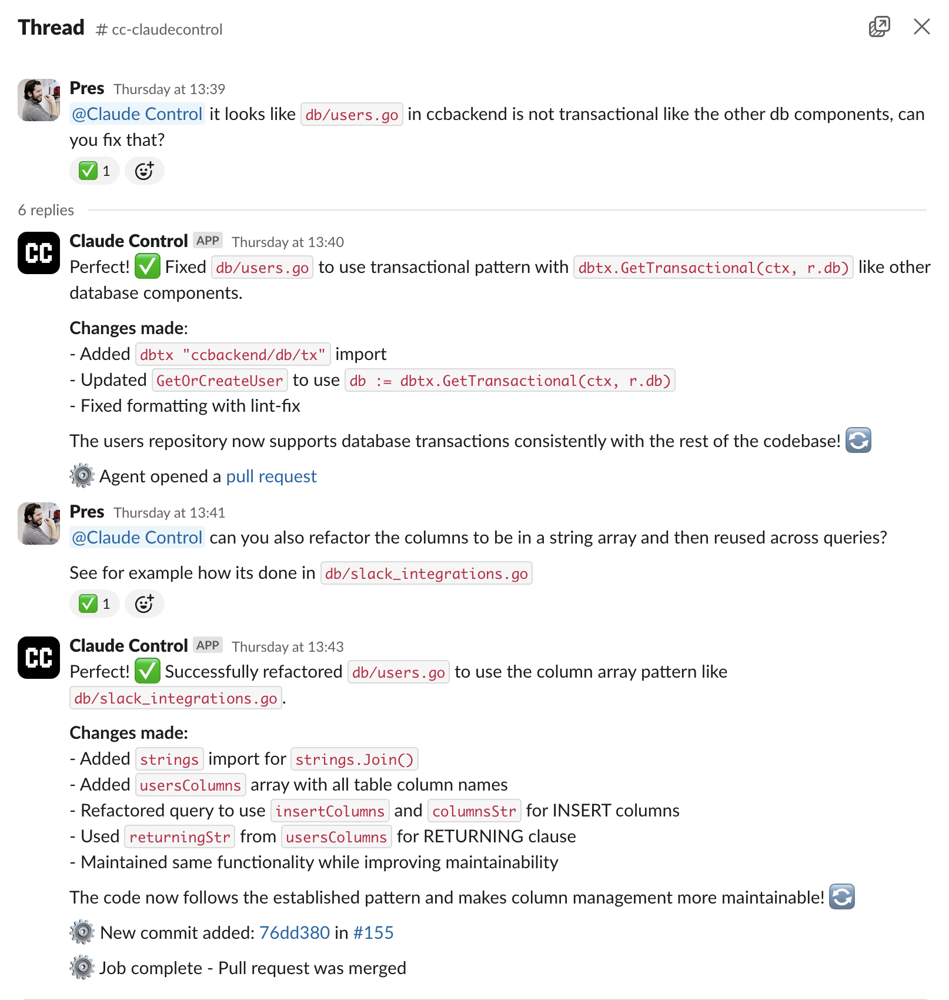

# Claude Control
The open-source platform for managing Claude Code background agents through Slack and Discord.



The SaaS version of Claude Control is available at https://claudecontrol.com.

For support, reach out to support@claudecontrol.com.

## Overview

Claude Control is a comprehensive system that bridges AI agents (like Claude Code) with team communication platforms. It enables organizations to:

- **Integrate AI Agents**: Connect Claude Code or Cursor agents to your workflow
- **Multi-Platform Support**: Work seamlessly across Slack and Discord
- **Real-time Job Management**: Assign, track, and monitor AI agent tasks
- **Organization Scoping**: Secure, isolated environments for different teams
- **Web Dashboard**: Modern React interface for managing agents and jobs

## Architecture

```
┌─────────────────┐    ┌─────────────────┐    ┌─────────────────┐
│   Slack/Discord │    │   ccfrontend    │    │    ccagent      │
│   Integrations  │    │  (Dashboard)    │    │  (AI Agents)    │
└─────────┬───────┘    └─────────┬───────┘    └─────────┬───────┘
          │                      │                      │
          │              HTTPS   │              Socket.IO
          │                      │                      │
          └──────────────────────┼──────────────────────┘
                                 │
                    ┌─────────────▼───────────┐
                    │      ccbackend          │
                    │   (Go HTTP Server)      │
                    │  - Socket.IO Server     │
                    │  - REST API             │
                    │  - Webhook Handlers     │
                    └─────────────┬───────────┘
                                  │
                    ┌─────────────▼───────────┐
                    │       PostgreSQL        │
                    └─────────────────────────┘
```

## Components

### ccbackend
**Go-based HTTP server** providing the core backend services:
- **Socket.IO Server**: Real-time communication with AI agents
- **Webhook Handlers**: Slack and Discord integration endpoints
- **REST API**: Dashboard data and management endpoints
- **Authentication**: Clerk JWT-based user authentication
- **Database Layer**: PostgreSQL with organization-scoped data isolation

[📖 Backend Documentation →](./ccbackend/README.md)

### ccfrontend
**Modern Next.js dashboard** for managing the platform:
- **React 19 + Next.js 15**: Latest web technologies
- **Clerk Authentication**: Secure user authentication
- **Real-time Updates**: Live job and agent status monitoring
- **Responsive Design**: Works across desktop and mobile devices

[📖 Frontend Documentation →](./ccfrontend/README.md)

### ccagent (External)
**CLI agent binary** that connects to the backend (separate repository):
- **Multi-Agent Support**: Compatible with Claude Code and Cursor
- **Git Integration**: Automatic branch management and PR creation
- **Job Execution**: Processes tasks assigned through Slack/Discord
- **Socket.IO Client**: Maintains persistent connection to backend

[📖 ccagent repository →](https://github.com/presmihaylov/ccagent)

## Quick Start

### Prerequisites
- **Go 1.21+** (for backend)
- **Node.js 18+** or **Bun** (for frontend)
- **PostgreSQL** database

### 1. Clone Repository
```bash
git clone https://github.com/yourusername/claudecontrol.git
cd claudecontrol
```

### 2. Setup Backend
```bash
cd ccbackend

# Copy environment template
cp .env.example .env
# Edit .env with your configuration

# Apply database migrations
./scripts/ccdbup.sh

# Install dependencies and run
make run
```

### 3. Setup Frontend
```bash
cd ccfrontend

# Install dependencies
bun install

# Copy environment template
cp .env.example .env.local
# Configure Clerk authentication keys

# Start development server
bun dev
```

### 4. Access Applications
- **Frontend Dashboard**: https://localhost:3000
- **Backend API**: http://localhost:8080
- **API Health Check**: http://localhost:8080/health

## Integration Setup

### Slack Integration
1. **Create Slack App** at https://api.slack.com/apps
2. **Configure OAuth Scopes**: `app_mentions:read`, `chat:write`, `reactions:read`, `reactions:write`, `team:read`, `users:read`
3. **Set Event Subscriptions**: Point to `<ccbackend-url>/slack/events`
4. **Install to Workspace**: Generate bot token and signing secret
5. **Configure Environment**: Add `SLACK_BOT_TOKEN` and `SLACK_SIGNING_SECRET`

### Discord Integration
1. **Create Discord Application** at https://discord.com/developers/applications
2. **Create Bot**: Generate bot token with message permissions
3. **Configure Webhooks**: Set webhook URL to `<ccbackend-url>/discord/events`
4. **Invite Bot**: Add bot to your Discord server
5. **Configure Environment**: Add Discord credentials to backend

### Agent Setup
1. **Download ccagent**: Get the latest release for your platform
2. **Configure API Key**: Generate organization API key from dashboard
3. **Connect Agent**: Run `CCAGENT_API_KEY=<api-key> ccagent --agent claude`
4. **Verify Connection**: Try interacting with Claude Control in Slack/Discord to verify agent is connected

## Development

### Database Management
```bash
# Apply all migrations
./scripts/ccdbup.sh

# Reset database (drops all schemas)
./scripts/ccdbdown.sh

# Create new migration
TIMESTAMP=$(date +"%Y%m%d%H%M%S")
touch supabase/migrations/${TIMESTAMP}_your_migration_name.sql
```

### Testing
```bash
# Backend tests
cd ccbackend && make test

# Run linting
make lint-fix      # Backend
bun run lint       # Frontend
```

### Recommended Cloud Deployment
- **Vercel/Netlify**: Frontend deployment
- **Railway/Render**: Backend deployment
- **Supabase**: Managed PostgreSQL database
- **Clerk**: Authentication service

## License
This project is licensed under the [Apache License 2.0](https://www.apache.org/licenses/LICENSE-2.0),
with an additional **Commons Clause** restriction that prohibits selling, reselling,
or commercially redistributing the software itself.

You are free to use, modify, and distribute this project for personal,
educational, or internal business purposes. Commercial resale or redistribution
requires a separate license from the author.

See the [LICENSE](./LICENSE) file for full details.
